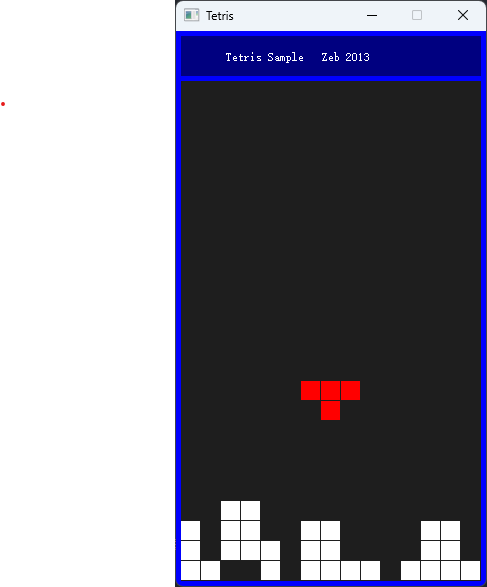

# Matrix Script Language

在 2003 年左右，大学本科期间，我开发了一个脚本语言，最早的版本是《编译原理》的课程设计，只包含了词法分析和语法分析。后续逐步完善成为一个完整可运行的脚本语言。

这是一个基于栈式虚拟机的脚本语言，期间参考了 lua 和 python 的实现。

后续的几年里，进行了一些重构和调整，并添加了 FFI 的支持，可以直接调用操作系统的 API，实用程度大大提高。

今天在整理备份硬盘资料的时候，发现了这个项目。

想着此项目虽然没有像 lua 或者 python 那样的成熟度，但是对于学习和掌握编译器的开发有着较大参考价值，于是开源出来。

## 特性支持

- 类 C 的语法
- 弱类型
- 函数调用
- 条件分支
- 循环
- 基于 C 语言的内嵌和扩展
- 基于扫描标记的垃圾回收
- 数组和字典对象
- 模块化
- 支持 FFI，可直接调用操作系统 API
